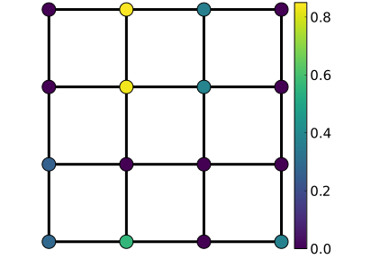
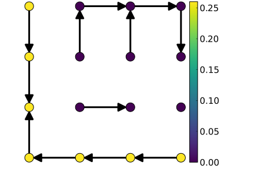
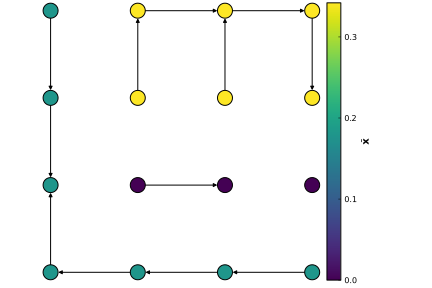
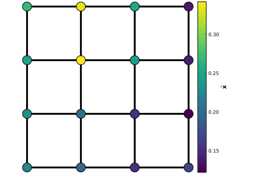
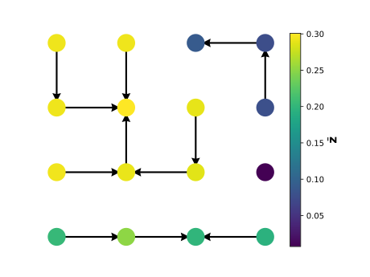

# Graph signal smoothing and interpolation
Signal denoising (i.e. eliminating noisy components in the signal) and impainting (i.e. completing) are two well-known problems in classical signal processing. In the case of graph signals (i.e. signals that are defined over the vertices), various approaches aim to output a solution that is a smooth signal (i.e. not highly varying through the edges) over the underlying graph structure.  

Graph Tikhonov regularization is one of these approaches that generically formulates the problem:
!!! note "Graph Tikhonov regularization"
    Given a graph $\mathcal{G}=(\mathcal{V},\mathcal{E},w)$, assume we have $p<|\mathcal{V}|$ noisy measurements $\mathbf{y}=[y_1,\dots,y_p]^\top$ over the vertices. We would like to obtain a smooth and complete signal over the vertices by solving:
    ```math
    \hat{\mathbf{x}} = \arg\min_{\mathbf{x} \in \mathbb{R}^n} \underbrace{|| \mathsf{M}\mathbf{y} - \mathbf{x} ||^2_\mathsf{Q}}_{{\text{Fidelity}}} +\underbrace{ \mathbf{x}^T\mathsf{L}\mathbf{x}}_{\text{Regularization}},
    ```
    where $\mathsf{M}\in\mathbb{R}^{n\times p}$ is a partial identity matrix, $\mathsf{Q}=\text{diag}(q_1,\dots,q_n)$ contains the pointwise regularization parameters, $\mathsf{L} $ is the graph Laplacian and $\mathbf{x}^T\mathsf{L}\mathbf{x}  = \sum\limits_{(i,j)\in\mathcal{E}}w(i,j)(x_i-x_j)^2$.
    The closed-form solution to this formulation is:
    ```math
        \hat{\mathbf{x}}  = \mathsf{K}\mathbf{y}',
    ```
    with $\mathsf{K}=(\mathsf{L} + \mathsf{Q})^{-1}\mathsf{Q}$ and $\mathbf{y}= \mathsf{M}\mathbf{y}$.
There is an unbiased estimator to estimate this matrix inverse via RSFs.
This estimator, defined as $\tilde{x}_i \coloneqq y'_{r_{\Phi_Q}(i)}$, operates as follows:
- Sample $\Phi_Q$ by setting $Q = (q_1, \dots,q_n)$,
- Then, within each tree of the sampled forest, propagate the measurement in the root.
See [pilavci2021graph](@cite) for more details.

This estimator can be called in KirchoffForests.jl as follows:
```@jldoctest
julia> using KirchoffForests,Graphs,LinearAlgebra,Random,PyPlot

julia> rng = MersenneTwister(12345); # Set random seed

julia> g = Graphs.grid([4,4])
{16, 24} undirected simple Int64 graph

# Generate an incomplete signal
julia> p = 8; n = nv(g); y= rand(rng, p); labelednodes = randperm(rng,n)[1:p]; M=I(n)[:,labelednodes];

julia> yprime = M*y;

julia> Q = rand(rng, n); # Set regularization parameters

julia> rf = random_forest(g,Q,rng)
Random forest. Size of original graph 16.
Number of trees 4


julia> xtilde = rf*yprime
16-element Array{Float64,1}:
0.0
0.0
0.0
0.0
0.8350140149860443
0.8350140149860443
0.8350140149860443
⋮
0.8350140149860443
0.8350140149860443
0.36580119057192695
0.8350140149860443
0.8350140149860443
0.36580119057192695
0.36580119057192695
```
Input graph and signal $\mathbf{y}'$ | Sampled forest `rf`  | The RSF estimator $\tilde{\mathbf{x}}$
:--------------:|:-------------:|:------------:
   |  |  

## Variance reduction on $\tilde{\mathbf{x}}$
There are several ways to reduce the variance of $\tilde{\mathbf{x}}$:

**Conditional Monte Carlo**: Thanks to the nice theoretical properties of RSFs, one can reduce the variance of $\tilde{\mathbf{x}}$ by propagating the locally weighted averages within each tree instead of the measurement of the root:
```math
    \bar{x}_i = \frac{\sum\limits_{j\in\mathcal{V}_{t(i)}}q_j y'_j}{\sum\limits_{k\in\mathcal{V}_{t(i)}}q_k}.
```
where $\mathcal{V}_{t(i)}$ is the set of vertices of the tree in $\Phi_Q$ which node $i$ belongs to.
See [pilavci2021graph](@cite) for more details.

This new estimator $\bar{\mathbf{x}}$ can be computed by using the structure called [`Partition`](@ref):
```@jldoctest
julia> p = Partition(rf)
Graph partition. Size of original graph 16.
Number of parts 4

# A bit elaborate way to compute the weighted average within each tree
julia> xbar = (p*(yprime .* Q)) ./ (p*Q)
16-element Array{Float64,1}:
 0.1995397697360063
 0.1995397697360063
 0.1995397697360063
 0.1995397697360063
 0.29575020044545924
 0.29575020044545924
 ⋮
 0.29575020044545924
 0.07777354234714352
 0.29575020044545924
 0.29575020044545924
 0.07777354234714352
 0.07777354234714352
```
The estimate by $\tilde{\mathbf{x}}$ | The estimate by $\bar{\mathbf{x}}$ | Exact Solution $\hat{\mathbf{x}}$
:-------------:|:------------:|:------------:|
  |  | 

**Control variate technique**: Another technique to reduce the variance/expected error is the control variate technique which defines the following estimator:
```math
\bar{\mathbf{z}} \coloneqq \bar{\mathbf{x}} - \alpha(\mathsf{K}^{-1}\bar{\mathbf{x}} - \mathbf{y}'),
```
where $\alpha$ is a hyperparameter which is easy to choose as described in [pilavci2021variance](@cite).   
```@jldoctest
julia> L = laplacian_matrix(g);

julia> α = 2*minimum(Q)/(minimum(Q)+maximum(degree(g))) # Chosen as suggested
0.009474493197967612

julia> zbar = xbar - α*((L * xbar) ./ Q + xbar  - yprime)
16-element Array{Float64,1}:
 0.20359013809375195
 0.25085798950864824
 0.1999698865149873
 0.19439266976895148
 0.29449512115874615
 0.2912856157260843
 ⋮
 0.28991581536522015
 0.0791621243376845
 0.2929481171830412
 0.29329844131810934
 0.0907881208925323
 0.07703667744919367
```

The estimate by $\bar{\mathbf{x}}$ | The estimate by $\bar{\mathbf{z}}$ | Exact Solution $\hat{\mathbf{x}}$
:-------------:|:------------:|:------------:|
  |  | 


## Some other applications

We find some applications of these estimators in certain graph-based optimization problems: 

- Solving Edge-LASSO via ADMM. [Notebook](https://gricad-gitlab.univ-grenoble-alpes.fr/barthesi/RandomForests.jl/-/blob/docs/docs/src/notebooks/Edge%20Lasso-%20ADMM/Edge%20Lasso-%20ADMM.md)
- Newton's method for Poisson noise [Notebook](https://gricad-gitlab.univ-grenoble-alpes.fr/barthesi/RandomForests.jl/-/blob/docs/docs/src/notebooks/Newton's%20method%20for%20Poisson%20noise/Newton's%20method%20for%20Poisson%20noise.md)

More explanations and examples are in the notebooks. 