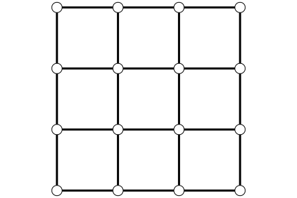

# What's an RSF?
In a graph $\mathcal{G}=(\mathcal{V},\mathcal{E},w)$ consisting of nodes $\mathcal{V}$, edges $\mathcal{E}$ and edge weights $w$, a tree is a subgraph without cycles, and a forest is a set of trees.
This package is focused on generating random *spanning* forests in a particular way.

4x4 Grid Graph $\mathcal{G}=(\mathcal{V},\mathcal{E},w)$|  A Spanning Tree $ \tau $ of $\mathcal{G}$ | A Spanning Forest $ \phi $ of $\mathcal{G}$
:-------------------------:|:-------------------------:|:-------------------------:
   |           |


## Random (rooted) spanning forests

Importantly, all the forests we use are considered to be *rooted*: each tree in the forest is directed, and all edges point towards the root of the tree. In the root and forest above, the roots are yellow.

When we talk about a "random spanning forest", denoted by $ \\Phi_q $, we mean a forest $ \\phi $ sampled from the following distribution:
```math
\mathbb{P}(\Phi_q = \phi)=\frac{1}{Z_q} q^{|\rho(\phi)|} \prod_{(i,j)\in \phi} w(i,j)
```

where:
- $ Z_q $ is the normalization constant such that:
```math
 \sum_{\phi}\mathbb{P}(\Phi_q = \phi)=1.
```
- $ \phi $ is a fixed forest,
- $ \rho(\phi) $ is the root set of $ \phi $,
- $ w(i,j) $ is the weight associated with the edge (i,j) (which equals 1 if the
  graph is unweighted)
- $ q > 0$ is a scalar that determines the average number of trees.

## Wilson's algorithm for sampling $\Phi_q$
Wilson's algorithm, proposed by [Wilson1996](@cite), is a simple and efficient algorithm to sample $\Phi_q$. It is based on loop-erased random walks that use a Markov chain $X$ with the following transition rule at step $n$:
```math
    \mathbb{P}(X(n+1)=j|X(n) = i) = \begin{cases}
          \frac{w(i,j)}{d_i+q} & i,j\not=\Gamma  \\
          \frac{q}{d_i+q} &  i\not=j=\Gamma \\
          1 &  i=\Gamma \\
    \end{cases}.
```
where $\Gamma$ is the additional absorption state.

Wilson's algorithm operates as follows:
1. Initialize the sets $\Delta=\{\Gamma\}$ and $\phi=\emptyset$,
2. Start $X$ from an arbitrary node in $\mathcal{V}\setminus\Delta$ and interrupt whenever $X(n)\in\Delta$,
3. Erase the loops in $X$ as they appear to obtain a path $\gamma$,
4. Update $\phi \leftarrow \phi\cup\gamma$ to $\phi$ and $\Delta \leftarrow \Delta\cup s(\gamma)$,
5. If $\mathcal{V}\setminus\Delta$ is an empty set, return $\phi$. Otherwise, go to step 2.

The following animation illustrates Wilson's algorithm on a 4x4 grid graph for sampling RSFs.


```@raw html
<table>
<tr>
<th align="center">
  
</th>
</tr>
<tr>
<th>
<ul><li> <a style="color:green">Green</a>: Current state of the random walker</ul></li> <ul><li><a style="color:yellow">Yellow</a>: Roots of the sampled forest </ul></li> <ul><li> <a style="color:darkblue">Dark Blue</a>: Nodes that are attached to a branch of the sampled forest</ul></li> <ul><li> <a style="color:lightblue">Blue</a>: Nodes that have not been attached to the forest. </ul></li>
</th>
</tr>
</table>
```

In KirchoffForests.jl, one can call this algorithm as follows:
```@jldoctest
julia> using KirchoffForests,Graphs

julia> q = 1.0
1.0

julia> g = grid([4,4])
{16, 24} undirected simple Int64 graph

julia> rf = random_forest(g,q)
Random forest. Size of original graph 16.
Number of trees 6
```

## Value of $q$ vs. the number of roots

Here are samples of $ \\Phi_q $ for different values of $ q $ :

$ q = 0.1$      |  $ q = 1.0$   | $ q = 5.0$
:--------------:|:-------------:|:------------:
   |  |

In a more generalized form of this distribution, one can consider varying values of $q$ over the vertices. In this case, we define a more generic distribution as follows:
```math
\mathbb{P}(\Phi_Q = \phi)=\frac{1}{Z_Q} \prod_{(r)\in\rho(\phi)}q_r \prod_{(i,j)\in \phi} w(i,j)
```
where $Q=(q_1,\dots,q_n)\in\mathbb{R}^{|\mathcal{V}|}$ and $Z_Q$ is the corresponding normalization constant. One can sample such RSFs via Wilson's algorithm by adapting the transition probability as
```math
    \mathbb{P}(X(n+1)=j|X(n) = i) = \begin{cases}
          \frac{w(i,j)}{d_i+q_i} & i,j\not=\Gamma  \\
          \frac{q_i}{d_i+q_i} &  i\not=j=\Gamma \\
          1 &  i=\Gamma \\
    \end{cases}.
```
This is also implemented in this package:
```@jldoctest
julia>  using KirchoffForests,Graphs

julia> g = grid([4,4])
{16, 24} undirected simple Int64 graph

julia> q = rand(16)
16-element Array{Float64,1}:
 0.9977096157204421
 0.7109113019106763
 0.006338471270104895
 0.6482324667545591
 0.7955474196350312
 0.5820420279765701
 ⋮
 0.9302933097261235
 0.5396398577920467
 0.39650118327620065
 0.09064936914066157
 0.9284607656864134
 0.6703257960094731

julia>  rf = random_forest(g,q)
Random forest. Size of original graph 16.
Number of trees 3
```

Non-homogenous $q$ values over the vertices reweight the probability of being a root for each vertex. Higher $q_i$ makes node $i$ more likely to be a root in an RSF.

Uniform $ q $ over vertices |  Varying $ q $ over vertices    
:--------------:|:-------------:
   |  

## Links with Graph Laplacian
Given a graph $\mathcal{G}=(\mathcal{V},\mathcal{E},w)$, graph Laplacian matrix $\mathsf{L}\in\mathbb{R}^{|\mathcal{V}|\times |\mathcal{V}|}$ is:

```math
    \mathsf{L}_{i,j} \coloneqq \begin{cases}
          -w(i,j) &  i\not=j \\
          \sum_{k\in\mathcal{N}(i)}w(i,k) & \text{otherwise} \\
    \end{cases}
```
where $\mathcal{N}(i)$ denotes the neighbors of node $i$ in $\mathcal{G}$.

### Matrix-Forest Theorem
An immediate link between $\Phi_Q$ and $\mathsf{L}$ is shown by [kirchhoff1847ueber](@cite) as
```math
    Z_Q =  \det (\mathsf{Q} + \mathsf{L})\mathsf{Q},
```
where $\mathsf{Q}=\text{diag}(q_1,\dots,q_n)$ and $Z_Q$ is the normalization constant for $\Phi_Q$.

### Root set of $\Phi_Q$ is a DPPs
Another well-known result is that $\rho(\Phi_Q)$ is a determinantal point process that verifies:
```math
  \forall S\in\mathcal{V},\quad \mathbb{P}(S \subseteq \rho(\Phi_Q)) =  \det \mathsf{K}_{S}
```
where $\mathsf{K}= (\mathsf{Q} + \mathsf{L})^{-1}\mathsf{Q}$ and $\mathsf{K}_S$ is the sub-matrix where $\mathsf{K}$ is restricted to the columns and rows indexed by $ S $. See [burton1993local](@cite) for more details.


### Probability of $i$ rooted in $j$
A bit less intuitive, but interesting link is about the root relation in $\Phi_q$. Define a function $r_\phi:\mathcal{V}\rightarrow\rho(\phi)$ that maps every node $i\in\mathcal{V}$ to its root in $\phi$. Then, the probability of having $i$ rooted in $j$ in $\Phi_q$ reads:
```math
  \mathbb{P}(r_{\Phi_Q}(i) = j) = \mathsf{K}_{i,j} \text{ with } \mathsf{K}= (\mathsf{Q} + \mathsf{L})^{-1}\mathsf{Q}
```
See [avena2018random](@cite) for more details.
