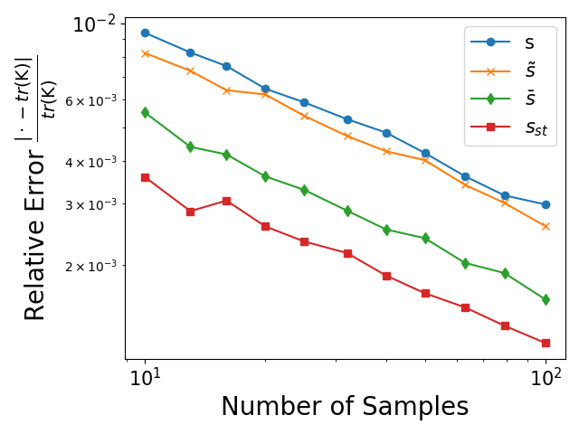

# Trace estimation via RSFs
Trace, i.e. the sum of diagonal entries of an input matrix, is an essential operation in linear algebra and it is of central importance in many applications in machine learning. However, it is not trivial to compute when the diagonals of the input matrix are expensive to compute.

Here we give efficient RSF-based estimators for approximating the trace of regularized inverse $\text{tr}(\mathsf{K})$ which normally requires computing the inverse of a large matrix. They are unbiased, easy to implement and parallelise and can be used for the regularized inverse of symmetric diagonally dominant matrices instead of graph Laplacians. See [Barthelme2019](@cite) for more details.

!!! note "RSF-based trace estimator"
    The proposed estimator $s$ is the number of roots in $\Phi_Q$:
    ```math
        s \coloneqq |\rho(\Phi_Q)|,
    ```
    which verifies $\mathbb{E}[s] = \text{tr}(\mathsf{K})$.

One can access the number of roots in the sampled forest as follows:
```@jldoctest
julia> using KirchoffForests,Graphs

julia> g = grid([4,4])
{16, 24} undirected simple Int64 graph

julia> q = 1.0
1.0

julia> rf = random_forest(g,q)
Random forest. Size of original graph 16.
Number of trees 8


julia> s = rf.nroots
8
```    

## Variance Reduction
By applying standard variance reduction techniques in Monte Carlo literature, one reduces the expected error/variance of this estimator.

### Control Variate
By adapting the control variate in [GTR](./gtr.md), one obtains the following estimators:
```math
    \tilde{s}\coloneqq s - α*(\text{tr}(\mathsf{K}^{-1}\tilde{\mathsf{S}}) - s) \\ 
    
    \bar{s}\coloneqq s - α*(\text{tr}(\mathsf{K}^{-1}\bar{\mathsf{S}}) - s)
```
where $\tilde{\mathsf{S}}$ and $\bar{\mathsf{S}}$ are typically low-rank linear operators that verifies $\tilde{\mathbf{x}} = \tilde{\mathsf{S}}\mathbf{y}$ and $\bar{\mathbf{x}} = \bar{\mathsf{S}}\mathbf{y}$, respectively. In other words, when applied to a vector, $\tilde{\mathsf{S}}$ propagates the measurements in the roots and $\bar{\mathsf{S}}$ propagates the average measurement within each tree.
One can choose $\alpha$ as suggested in [GTR](./gtr.md) and for more details, see [pilavci2022variance](@cite).

### Stratification
Another variance reduction technique we can use for trace estimation is stratification. Imagine a random variable $X$ with an unknown expectation $\mu$. This technique suggests:

1 - Collecting $N_k$ conditional samples of $X|Y\in C_k$ for each $k\in\{1,\dots,K\}$ where $Y$ is another random variable with a known probability distribution over its sample space $\Omega =\cup_{k=1}^{K} C_k$,

2 - Then approximating $\mu$ by using the law of iterated expectation as follows: 
```math
    \mu_{st} \coloneqq \underbrace{\sum_{k=1}^K\underbrace{{\frac{1}{N_k}\left(\sum_{j=1 }^{N_k} X^{(j)}|Y\in C_k  \right)}}_{\text{Conditional Expectation}}\mathbb{P}(Y\in C_i)}_{\text{Marginalization over } Y}.
```
For certain allocations of samples $N_k$'s, the theoretical variance of $\mu_{st}$ is less than that of the naive estimator. We can build such a setup for trace estimator $s$ by setting $Y$ to "the roots that are sampled at the first visits" of random walks in Wilson's algorithm. These roots are a subset of $\rho(\Phi_q)$ and their distribution (Poisson-Binom distribution) is tractable by using the degrees of nodes. More details can be found in [pilavcithesis](@cite). 

All of these techniques are implemented in [`trace_estimator`](@ref) as different variants. Here is an example comparing all these methods: 

```julia 
using KirchoffForests,Graphs,LinearAlgebra,PyPlot, StatsBase
pygui(true)
n = 10000
g = barabasi_albert(n,10)
L = Matrix(laplacian_matrix(g))
q = 1.0
tr_exact = tr(q*inv(L+q*I)) 

α=2*q/(2*q+mean(degree(g)))
NREPRANGE = Int64.(round.(10 .^ (1:0.05:2)))

err_tr_est = zeros(length(NREPRANGE))
err_tr_cv_tilde = zeros(length(NREPRANGE))
err_tr_cv_bar = zeros(length(NREPRANGE))
err_tr_st = zeros(length(NREPRANGE))

EXPREP = 1000
for er = 1 : EXPREP
    for (idx,NREP) in enumerate(NREPRANGE)
        tr_est = trace_estimator(g,q;variant=1,NREP=NREP) # The forest estimator s
        err_tr_est[idx] += (tr_est - tr_exact)^2
        tr_est_cv_tilde = trace_estimator(g,q;variant=2,α=α,NREP=NREP) # s_tilde 
        err_tr_cv_tilde[idx] += (tr_est_cv_tilde - tr_exact)^2
        tr_est_cv_bar = trace_estimator(g,q;variant=3,α=α,NREP=NREP) # s_bar
        err_tr_cv_bar[idx] += (tr_est_cv_bar - tr_exact)^2
        tr_est_st = trace_estimator(g,q;variant=4,α=α,NREP=NREP) # stratified estimator s_st
        err_tr_st[idx] += (tr_est_st - tr_exact)^2
    end
end

plot(NREPRANGE,err_tr_est ./ EXPREP,label="s")
plot(NREPRANGE,err_tr_cv_tilde ./ EXPREP,label="\$ \\tilde{s}\$")
plot(NREPRANGE,err_tr_cv_bar ./ EXPREP,label="\$ \\bar{s}\$")
plot(NREPRANGE,err_tr_st ./ EXPREP,label="\$ s_{st}\$")

xlabel("Number of Samples")
ylabel("Mean Square Error")
yscale("log")
xscale("log")
legend()
```
